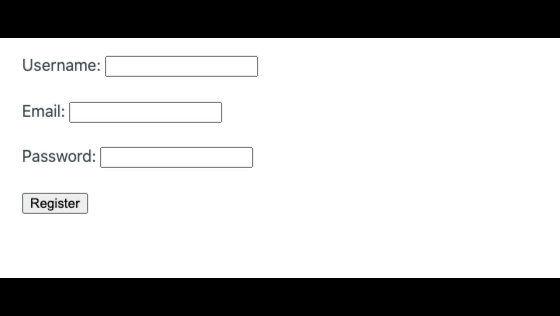
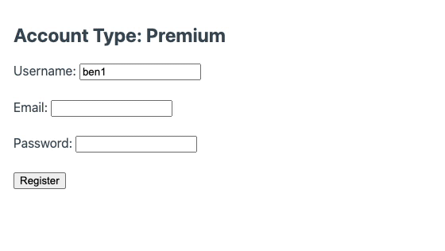
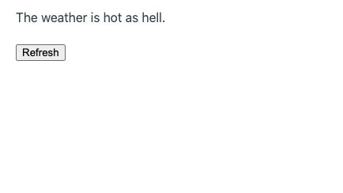

<p align="center"></p>

# Sprig

### A reactive Twig component framework for [Craft CMS](https://craftcms.com/).

Sprig is a free Craft plugin that allows you to create reactive components from Twig templates and/or PHP classes. These components can re-render themselves on user-triggered events (clicks, changes to input fields, form submissions) using AJAX requests, without having to write a single line of JavaScript.

It's basically [Laravel Livewire](https://laravel-livewire.com/) for [Craft CMS](https://craftcms.com/).

> This plugin is currently in development. Please contribute by reporting any bugs or issues.

## How it Works 

Take the following Twig template which contains a user registration form (similar to the [Craft docs](https://docs.craftcms.com/v3/dev/examples/user-registration-form.html)).

```twig
{#-- main.twig --#}

<h1>User Registration Form</h1>

<form method="post">
    {{ csrfInput() }}
    {{ actionInput('users/save-user') }}
   
    <input type="text" name="username" value="">
    <input type="email" name="email" value="">
    <input type="password" name="password" value="">
    <input type="submit" value="Register">
</form>
```

We can turn the `username` input field into a component using the `sprig()` function, passing in a template path. Note that in this case, a "component" is just another name for a reactive Twig template.

```twig
{#-- main.twig --#}

<h1>User Registration Form</h1>

<form method="post">
    {{ csrfInput() }}
    {{ actionInput('users/save-user') }}
   
    {# Creates a component from the template path #}
    {{ sprig('_components/username') }}

    <input type="email" name="email" value="">
    <input type="password" name="password" value="">
    <input type="submit" value="Register">
</form>

{# Add the required script like this or using your own build process #}
{{ sprig.script }}
```

```twig
{#-- _components/username.twig --#}

<input type="text" name="username" value="">
```

We can now add reactivity by adding the `sprig` attribute to any elements that should be triggered on certain events. 

```twig
{#-- _components/username.twig --#}

<input sprig type="text" name="username" value="">
```

Now each time the `username` field value changes, the component will re-render itself. Any `input` fields (including `textarea` and select`select` fields) in the component will be available as template variables.

```twig
{#-- _components/username.twig --#}

<input sprig type="text" name="username" value="{{ username ?? '' }}">
```

We can now get creative in our component. Let's check if a user with the username already exists in Craft whenever the `username` field changes.

```twig
{#-- _components/username.twig --#}

<input sprig type="text" name="username" value="{{ username ?? '' }}">


    <span class="warning">
        The username "{{ username }}" is already taken!
    </span>

```



This component will re-render itself every time the `change` event of the `username` input field is triggered. We can make it so that the re-render is triggered on `keyup` events provided the field value has changed and the user hasn't typed anything for 1 second.

```twig
<input sprig s-trigger="keyup changed delay:1s" type="text" name="username" value="{{ username ?? '' }}">
```

Let's say we now want to make the entire form a reactive component. To do so we'll use the `sprig()` function again and create a new template for our component.

```twig
{#-- main.twig --#}

<h1>User Registration Form</h1>

{# Creates a component from the template path #}
{{ sprig('_components/registration-form') }}

{# Add the required script like this or using your own build process #}
{{ sprig.script }}
```

```twig
{#-- _components/registration-form.twig --#}

<form method="post">
    {{ csrfInput() }}
    {{ actionInput('users/save-user') }}
   
    {{ sprig('_components/username') }}

    <input type="email" name="email" value="">
    <input type="password" name="password" value="">
    <input type="submit" value="Register">
</form>
```

We can make the form reactive by adding the `sprig` attribute to it. We'll also use the `s-method` and `s-action` attributes to specify that the form should be `POST`ed and call the `users/save-user` action. Because we set the `s-method` to `post`, Sprig will automatically send a CSRF token along with our request, so we can remove it from the form. We can also remove the action input field as Sprig with add that for us too.

```twig
{#-- _components/registration-form.twig --#}

<form sprig s-method="post" s-action="users/save-user">
    {{ sprig('_components/username') }}

    <input type="email" name="email" value="">
    <input type="password" name="password" value="">
    <input type="submit" value="Register">
</form>
```

Now, whenever the form is submitted, it will POST an AJAX request to the `users/save-user` action, and the component will be re-rendered. To make it display a success or error message, lets make it a bit smarter with some Twig logic.

```twig
{#-- _components/registration-form.twig --#}

{# The `user` variable will be defined if the `users/save-user` action was called #}


    <p class="success">
        Your registration was successful!    
    </p>



    
        
            <p class="error">{{ error }}</p>
        
    

    <form sprig s-method="post" s-action="users/save-user">
        {{ sprig('_components/username'), {
            username: username ?? '',
        }) }}
    
        <input type="email" name="email" value="{{ email ?? '' }}">
        <input type="password" name="password" value="{{ password ?? '' }}">
        <input type="submit" value="Register">
    </form>


```



When creating a new component, you can pass it one or more values that will become available as variables in the template.

```twig
{# Creates a component from the template path, passing in the provided variables #}
{{ sprig('_components/registration-form', {
    accountType: 'Premium',
}) }}
```

So now the `accountType` variable will be available in the component.

```twig
<h2>Account Type: {{ accountType }}</h2>

<form sprig s-method="post" s-action="users/save-user">
```

Any element can be made reactive by adding the `sprig` attribute to it. By default, the "natural" event of an element will be used as the trigger:

- `input`, `textarea` and `select` elements are triggered on the `change` event.
- `form` elements are triggered on the `submit` event.
- All other elements are triggered by the `click` event.

If you want different behaviour you can use the `s-trigger` attribute to specify the trigger.

```twig
<div sprig s-trigger="mouseenter">
    Mouse over me to re-render the component.
</div>
```

If you want a trigger to only happen once, you can use the `once` modifier for the trigger.

```twig
<div sprig s-trigger="mouseenter once">
    Mouse over me to re-render the component only once.
</div>
```

## Htmx

Sprig requires and uses [htmx](https://htmx.org/) under the hood, so anything you can do with `hx-` attributes you can also do with `s-` attributes. See the [full attribute reference](https://htmx.org/reference).

## Alertnative Syntax

If for whatever reason you cannot or do not want to use `s-` attributes, you can use `sprig-` attributes in the same way.

## Component Class

In the examples above, we passed a template path into the `sprig()` function, which created a component directly from that template. If you want to have more control over the component and be able to use PHP logic then you can create a Component class.

First, create a new folder called `sprig/components` in your project's root directory. This is where your Component classes should be created. In order for our Component classes to be autoloaded, we need to add the following to the project's `composer.json` file.

```json
  "autoload": {
    "psr-4": {
      "sprig\\components\\": "sprig/components/"
    }
  },
```

Running `composer dump` will regenerate the optimized autoload files for us.

Let's create a file called `CheckWeather.php` for our component.

```php
<?php
namespace sprig\components;

use putyourlightson\sprig\base\Component;

class CheckWeather extends Component
{
    public $weather = 'sunny with a slight breeze';
}
```

In most cases, you'll want the component to render a template. This can be done by setting a protected property `$template` to the template path. All of the public properties of the class will be automatically be available as variables in the template.

```php
<?php
namespace sprig\components;

use putyourlightson\sprig\base\Component;

class CheckWeather extends Component
{
    protected $template = '_components/check-weather';

    public $weather = 'sunny with a slight breeze';
}
```

```twig
{#-- _components/check-weather --#}

The weather is {{ weather }}
```

If you prefer then you can override the `render` method which will be called each time the component is rendered.

```php
public function render(): string
{
    return 'The weather is ' . $this->weather;
}
```

Now we can create a component from our `CheckWeather` class as follows.

```twig
{#-- main.twig --#}

{# Creates a component from the CheckWeather class  #}
{{ sprig('CheckWeather') }}

{# Outputs: The weather is sunny with a slight breeze #}
```

We can pass property values into the component as well.

```twig
{# Creates a component from the CheckWeather class  #}
{{ sprig('CheckWeather', {
    weather: 'hot as hell',
}) }}

{# Outputs: The weather is hot as hell #}
```

We can also define actions as public methods in our `CheckWeather` class.

```php
public function refresh()
{
    $this->weather = SomeWeatherApi::getCurrentWeather();
}
```

To call the action, we use the `s-action` attribute.
 
```twig
{#-- _components/check-weather.twig --#}

The weather is {{ weather }}.

{# Clicking the button will call the `refresh()` method and then re-render the component #}
<button sprig s-action="refresh">Refresh</button>
```



## Requirements

Craft CMS 3.0.0 or later.

## Installation

Install the plugin using composer.

```
composer require putyourlightson/craft-sprig:^0.1.0
```

## License

This plugin is licensed for free under the MIT License.

## Acknowledgements

This project stands on the shoulders of giants:

- Entirely inspired by [Laravel Livewire](https://laravel-livewire.com/).
- JavaScript magic provided by [Htmx](https://htmx.org/).
- Built for the excellent [Craft CMS](https://craftcms.com/).

Special thanks to Andrew Welch, John D. Wells and Keyur for being a sounding board and a source of valuable input. Thanks also goes out to 🇿 (you know who you are).

Icon: Herb emoji by [Twemoji](https://twemoji.twitter.com/).

---

Created by [PutYourLightsOn](https://putyourlightson.com/).
